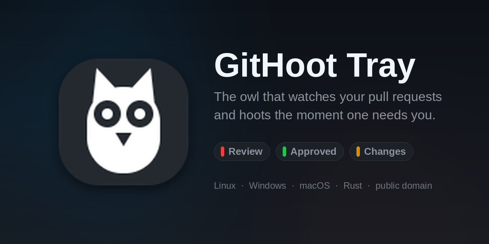

<div align="center">



### A tray owl that watches your pull requests and hoots the moment one needs you.

[](../../releases/latest)
[](../../actions/workflows/ci.yml)
[](../../releases)
[](LICENSE)


[**Download**](#get-it) · [**What the icon says**](#what-the-icon-says) · [**Settings**](docs/menu-and-settings.md#settings) · [**Deep dives**](#dig-deeper)

</div>

---

## Why

- **In sync.** It asks GitHub itself, at least every 60 seconds. Email tells you once and then goes
  stale; a bar here is true right now, and clears itself the moment you act.
- **In view.** Always on screen, no tab to open and no inbox to sweep. One glance says whether a
  teammate is waiting on you.
- **It hoots.** A count going up makes a sound, so you react in minutes instead of at the next
  sweep.

Three things it watches:

| | |
|:---:|---|
|  | **somebody wants your review** |
|  | **your pull request was approved** |
|  | **a reviewer asked for changes** |

Every lit bar has a menu entry that takes you to it, with the count on the label. No `gh` CLI, no
token to paste, nothing to register: sign-in is GitHub's own Device Flow, and the device code is
already on your clipboard when the dialog appears.

## Get it

| Platform | Asset |
|---|---|
| 🪟 Windows x86-64 | [`githoot-tray.exe`](../../releases/latest) |
| 🐧 Linux x86-64 | [`githoot-tray`](../../releases/latest) |
| 🍎 macOS Apple Silicon | [`githoot-tray-macos-aarch64.zip`](../../releases/latest) |

Or build it:

```bash
cargo build --release          # -> target/release/githoot-tray
```

<details>
<summary><b>First launch, and the two platform footnotes</b></summary>

**The tray icon appears immediately** — it never blocks on a sign-in. If PR status has no credential
yet, the owl wears a red exclamation and the menu offers **Authenticate GitHub PR Status**; pick it
when it suits you. That works straight away for your own account and public repos. For a private
org's repos, the GitHub App has to be [**installed** on that org](docs/pr-status.md#why-a-github-app).

`~/.githoot-tray/config.txt` is written on first run with every setting at its default.

**A first run also asks once whether to start GitHoot when you sign in** — Windows `Run` value, XDG
autostart entry or macOS Launch Agent, for your account only, removable with your OS's own startup
tool. Declining writes nothing and nothing asks again; a prompt that cannot be shown counts as no. On
Windows the icon is also asked to stay on the taskbar rather than in the **^** overflow flyout, which
only ever fills in a blank and never overrides a choice you have made →
[the whole thing](docs/startup.md).

**macOS:** the bundle is ad-hoc signed, not notarized, so clear the quarantine flag once —
`xattr -dr com.apple.quarantine githoot-tray.app`. The bare binary takes a Dock icon, so use
`scripts/bundle-macos.sh` for a local build. **Windows:** Defender's ML models
[sometimes flag it](docs/troubleshooting.md#windows-defender-may-flag-the-binary), and every release
ships a signed digest list so you can check the download rather than take anyone's word for it.

</details>

## What the icon says

The owl is the thing that sits still and watches so you do not have to. It carries no state; the
marks around it do, and **every mark combines with every other**, so any state can be drawn at once.

| Mark | Means |
|:---:|---|
|  | Nothing pending. Genuinely nothing — an unreadable answer is never reported as a confident zero |
|  | Red bar: a PR waits on your review |
|  | Green bar: one of your PRs is approved |
|  | Amber bar: a reviewer asked for changes |
|  | Green arrow: a newer release is available |
|  | Red exclamation: not authorized, GitHub is down, or a poll failed — the tooltip says which |
|  | All three at once. A very bad Monday |

Those are the real icons the app draws, composited at runtime from one owl, not mock-ups. Positions
are fixed, so a bar always means the same thing → [the whole design](docs/icons.md).

## Configure it

Everything lives in `~/.githoot-tray/config.txt`, one `key=value` per line. The menu's
**Open Settings** opens it and offers a restart once your edits settle.

```ini
reviewRequested=on          # the red bar
readyToMerge=on             # the green bar (approved)
changesRequested=on         # the amber bar
sound=on                    # hoot when a count rises
updateCheck=on              # check for a newer release daily
statusComponents=Pull Requests, Actions, API Requests   # which GitHub outages may raise the mark
```

Switching a PR signal off removes its bar **and stops it being searched for**, so it costs nothing
against the rate limit → [every key, and what it costs](docs/menu-and-settings.md#settings).

## Under the hood

- **The green bar reads the reviews, not `review:approved`.** That qualifier is a projection of
  GitHub's *review policy* verdict, and a repo that requires no reviews reports `null` on every PR,
  approved or not. Measured: 100 of 100 PRs `null`, six carrying a real approval → [why](docs/pr-status.md).
- **Changes requested clears itself when you hand the work back**, which GitHub's own search cannot
  express — re-requesting a review does not dismiss the old verdict.
- **A read-only fine-grained GitHub App**, not a classic `repo` scope, which would also grant write
  to everything you can reach. Contents is deliberately not requested.
- **The self-updater verifies a minisign signature against a key compiled into the copy you already
  have**, because TLS and a checksum over the same channel prove nothing an attacker with a trusted
  root cannot forge → [the whole chain](docs/updates-and-releases.md#what-is-verified-and-what-that-proves).
- **A failed poll is never a zero.** The last known count is held, the exclamation goes up, and the
  tooltip names the axis that has gone quiet.
- Rust, no audio crate, no `gh` shell-outs. `libappindicator` + GTK 3 on Linux, `tray-icon` +
  `winit` on Windows and macOS.

## Dig deeper

| | |
|---|---|
| [Icons](docs/icons.md) | Every mark, why the geometry is what it is, what combines |
| [Startup](docs/startup.md) | The one first-run question, what it writes on each platform, and how to undo it |
| [Menu and settings](docs/menu-and-settings.md) | All menu entries and all config keys |
| [PR status](docs/pr-status.md) | The three queries, the GraphQL rationale, the GitHub App |
| [The hoot](docs/hoot.md) | Exactly which transitions make a sound, and which stay quiet |
| [Troubleshooting](docs/troubleshooting.md) | Tooltip meanings, the log, the Defender verdict |
| [Updates and releases](docs/updates-and-releases.md) | Verification, recovery, immutable releases, signing keys |

## License

[The Unlicense](LICENSE) — public domain, no restrictions. That covers the code and the icons, which
were drawn for this project.

One exception, listed in [NOTICE](NOTICE): `assets/hoot.mp3` is a sound effect by
[elevenlabs.io](https://elevenlabs.io/sound-effects/free), used under their free plan, which requires
attribution and permits non-commercial use only. This project is non-commercial, so that is the basis
it is used on here — but a commercial use of GitHoot Tray needs its own licence for that clip, or a
replacement file. Nothing in the code cares which clip is at that path.

> **Built with AI assistance** — specifically Claude (Anthropic), driven through Claude Code, which
> did the bulk of the hauling: most of the code, the tests, the release workflow and these docs. The
> human author set the goals, reviewed and directed the work throughout, and is accountable for what
> ships. Roughly half the commits carry a `Co-Authored-By: Claude` trailer, so `git log` shows where
> that help actually landed.
