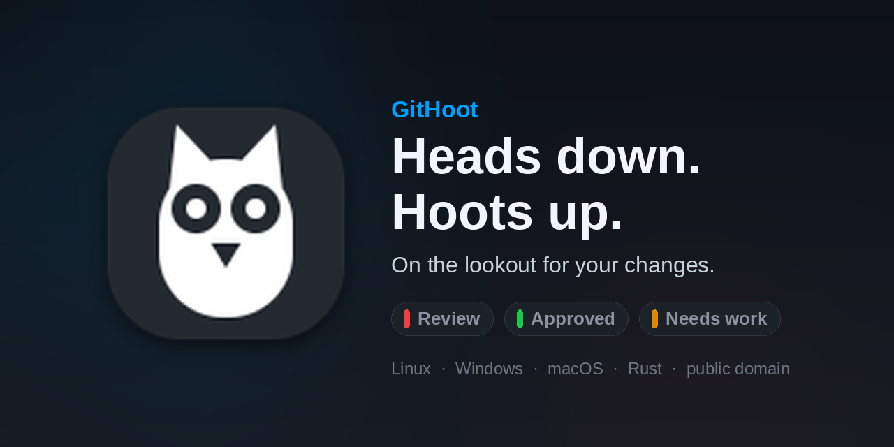

<div align="center">



### Heads down. Hoots up.

An owl in your system tray, on the lookout for your changes on GitHub and GitLab.<br>
It lights up when something needs you, and hoots once when it is news.

[](../../releases/latest)
[](../../actions/workflows/ci.yml)
[](../../releases)
[](LICENSE)


[**Download**](#get-it) · [**What the icon says**](#what-the-icon-says) · [**Settings**](docs/menu-and-settings.md#settings) · [**Deep dives**](#dig-deeper)

</div>

---

## Why

- **Stay in flow.** No tab to refresh, no inbox to sweep. The owl checks GitHub and GitLab for you, at
  least once a minute, so you can keep your head down.
- **Know at a glance.** Three coloured bars on one icon say whether anything is waiting on you. Act on
  it and the bar clears itself.
- **Hear only news.** One hoot when something new needs you, silence the rest of the time. It can tell
  a new pull request from the same one handed back by a flaky search index → [the hoot](docs/hoot.md).

What it is on the lookout for:

| | |
|:---:|---|
|  | **somebody wants your review** |
|  | **your change was approved** |
|  | **your change needs work** |

Every lit bar has a menu entry with its count. Clicking one opens **a page GitHoot renders itself**,
listing exactly what that bar counted, with check states and every reviewer's verdict. No forge search
URL can express what two of the three bars count → [the PR page](docs/pr-page.md).

No CLI to install, no token to paste: you sign in with your forge's own device flow, and the code is
already on your clipboard when the dialog appears.

## Get it

| Platform | Asset |
|---|---|
| 🪟 Windows x86-64 | [`githoot.exe`](../../releases/latest) |
| 🐧 Linux x86-64 | [`githoot`](../../releases/latest) |
| 🍎 macOS Apple Silicon | [`githoot-macos-aarch64.zip`](../../releases/latest) |

> **Coming from `githoot-tray`?** Install this one by hand, once, and rename `~/.githoot-tray/` to
> `~/.githoot/` before its first start → [the three steps](docs/menu-and-settings.md#settings).

Or build it:

```bash
cargo build --release          # -> target/release/githoot
```

<details>
<summary><b>First launch, and the two platform footnotes</b></summary>

**The tray icon appears immediately** — it never blocks on a sign-in. If PR status has no credential
yet, the owl wears a red exclamation and the menu offers **Authenticate GitHub PR Status**; pick it
when it suits you. That works straight away for your own account and public repos. For a private
org's repos, the GitHub App has to be [**installed** on that org](docs/pr-status.md#why-a-github-app).

`~/.githoot/config.txt` is written on first run with every setting at its default.

**A first run also asks once whether to start GitHoot when you sign in** — Windows `Run` value, XDG
autostart entry or macOS Launch Agent, for your account only, removable with your OS's own startup
tool. Declining writes nothing and nothing asks again; a prompt that cannot be shown counts as no. On
Windows the icon is also asked to stay on the taskbar rather than in the **^** overflow flyout, which
only ever fills in a blank and never overrides a choice you have made →
[the whole thing](docs/startup.md).

**macOS:** the bundle is ad-hoc signed, not notarized, so clear the quarantine flag once —
`xattr -dr com.apple.quarantine githoot.app`. The bare binary takes a Dock icon, so use
`scripts/bundle-macos.sh` for a local build. **Windows:** Defender's ML models
[sometimes flag it](docs/troubleshooting.md#windows-defender-may-flag-the-binary), and every release
ships a signed digest list so you can check the download rather than take anyone's word for it.

</details>

## What the icon says

The owl is the thing that sits still and watches so you do not have to. It carries no state; the
marks around it do, and **every mark combines with every other**, so any state can be drawn at once.

| Mark | Means |
|:---:|---|
|  | Nothing pending. Genuinely nothing — an unreadable answer is never reported as a confident zero |
|  | Red bar: a PR waits on your review |
|  | Green bar: one of your PRs is approved |
|  | Amber bar: a reviewer asked for changes, a conflict is blocking one, or an approved one failed its checks |
|  | Green arrow: a newer release is available |
|  | Red exclamation: sign-in needed, a portal is down, or a poll failed; the tooltip says which |
|  | All three at once. A very bad Monday |

Those are the real icons the app draws, composited at runtime from one owl, not mock-ups. Positions
are fixed, so a bar always means the same thing → [the whole design](docs/icons.md).

### How each state is decided

The same rules apply to every portal, GitHub and GitLab alike. "Pull request" covers GitLab's merge
requests. Only pull requests that are **open and not drafts** are ever considered: a draft is work
nobody can act on yet, so it lights nothing until it is marked ready.

**Red bar: somebody wants your review.** A pull request counts when a review has been asked of you and
you have not given it yet.

- Giving your review, whether approving, asking for changes or commenting, takes it off the bar.
  Being asked again puts it back.
- A request made to a team you belong to counts too (GitHub). Anyone on the team reviewing clears it.
- Pull requests opened by bots, such as dependency updaters, are left out.

**Green bar: your pull request was approved.** One of your own pull requests counts when:

- at least one person has approved it,
- nobody's request for changes still stands,
- it does not conflict with the branch it merges into,
- its checks have finished without failing (while they are still running it waits, on neither bar),
- and no automatic reviewer comments are still open (GitHub's Copilot, if you count those).

It reports good news, not permission to merge: your repository's required number of approvals is not
checked. A pull request with no checks at all counts as soon as it is approved.

**Amber bar: your pull request needs work.** One of your own pull requests counts when any of these is
true:

- a reviewer asked for changes and you have not handed it back to them by asking for their review
  again,
- it conflicts with the branch it merges into while somebody is reviewing it (a conflict on a pull
  request nobody is looking at blocks nobody),
- it is approved but its checks failed (red CI on an approved pull request is work, not good news),
- the automatic reviewer left comments that are still open and not outdated (GitHub's Copilot, if you
  count those).

**The rules can be switched** on **General**, one folded section per bar: the red and green bars are
drawn as the path a pull request walks to them, the amber bar as its list of reasons. A green-bar rule
switched off is ignored on both green and amber; on the red bar you can also count only requests naming
you directly (GitHub), or let pull requests opened by bots in.

**The green and amber bars never light for the same pull request.** Anything that puts it on amber takes
it off green: work comes before good news, and the approval is still there once the work is done.

**Muted pull requests count for nothing** until the mute ends, then return as if new. Each bar can be
switched off, which also stops it being asked for.

**The hoot** plays when a pull request arrives on a bar that you have not been told about yet. Leaving a
bar is silent, and several arriving at once are one hoot → [the hoot](docs/hoot.md).

**The exclamation** means GitHoot cannot vouch for what it shows: you need to sign in, a portal reports
an outage, or asking failed. A failed answer is never shown as zero; the last known state is kept and
the tooltip says what went wrong.

**The arrow** means a newer GitHoot release is available. Install it from the tray menu or from
**Updates** in the settings pages.

## Configure it

The hoot and starting at sign-in are checkboxes under the menu's **Settings**, and take effect the
moment you click them. Everything else is on **Settings ▸ Open settings page**, and lives in
`~/.githoot/config.txt`, one `key=value` per line, if you prefer editing it by hand.

```ini
reviewRequested=on          # the red bar
readyToMerge=on             # the green bar (approved)
changesRequested=on         # the amber bar
sound=on                    # hoot when a count rises
pigeon=off                  # a pigeon instead of the hoot
updateCheck=on              # check for a newer release daily
statusComponents=Pull Requests, Actions, API Requests   # which GitHub outages may raise the mark
```

GitLab is a portal too. **Settings ▸ Portals ▸ Sign in to GitLab** adds gitlab.com and signs in, in one step. That writes
the lines below; a self-managed instance needs them by hand, with its own OAuth application (non-confidential,
scope `read_api`), because the one GitHoot ships is registered on gitlab.com:

```ini
portal.github.type=github
portal.gitlab.type=gitlab
# portal.gitlab.url=https://git.example.com          # self-managed only
# portal.gitlab.clientId=<your application id>       # self-managed only
```

Switching a PR signal off removes its bar **and stops it being searched for**, so it costs nothing
against the rate limit → [every key, and what it costs](docs/menu-and-settings.md#settings).

## Under the hood

- **The green bar reads the reviews, not `review:approved`.** That qualifier is a projection of
  GitHub's *review policy* verdict, and a repo that requires no reviews reports `null` on every PR,
  approved or not. Measured: 100 of 100 PRs `null`, six carrying a real approval → [why](docs/pr-status.md).
- **The amber bar means work required, not just changes requested.** It counts a reviewer's objection
  that still stands *and* a merge conflict with somebody waiting on it — neither of which GitHub's own
  search can express, since re-requesting a review does not dismiss the old verdict and `mergeable` is
  not a qualifier at all → [both halves](docs/pr-status.md).
- **A read-only fine-grained GitHub App**, not a classic `repo` scope, which would also grant write
  to everything you can reach. Contents is deliberately not requested.
- **The self-updater verifies a minisign signature against a key compiled into the copy you already
  have**, because TLS and a checksum over the same channel prove nothing an attacker with a trusted
  root cannot forge → [the whole chain](docs/updates-and-releases.md#what-is-verified-and-what-that-proves).
- **A failed poll is never a zero.** The last known count is held, the exclamation goes up, and the
  tooltip names the axis that has gone quiet. The PR page says "not known" rather than showing you an
  empty list it cannot stand behind.
- **The PR page is served from loopback, not written to disk**, on a port and a path token that are new
  every run and die with the process. It binds `127.0.0.1` and `[::1]` only, checks the `Host` header
  against DNS rebinding, sends no CORS header and no `Referer` → [what guards it](docs/pr-page.md#what-guards-it).
- Rust, no audio crate, no `gh` shell-outs. `libappindicator` + GTK 3 on Linux, `tray-icon` +
  `winit` on Windows and macOS.

## Dig deeper

| | |
|---|---|
| [Icons](docs/icons.md) | Every mark, why the geometry is what it is, what combines |
| [Startup](docs/startup.md) | The one first-run question, what it writes on each platform, and how to undo it |
| [Menu and settings](docs/menu-and-settings.md) | All menu entries and all config keys |
| [PR status](docs/pr-status.md) | The three queries, the GraphQL rationale, the GitHub App |
| [Portals](docs/portals.md) | The seam GitHub and GitLab sit behind, and what Bitbucket will have to bring to it |
| [The PR page](docs/pr-page.md) | What the menu entries open, why it is served locally, and what guards it |
| [Settings pages](docs/menu-and-settings.md#the-settings-pages) | Every setting in your browser, by what it is about, with a sidebar; and the guard writing needed |
| [The local API](docs/local-api.md) | Serving the judged lists as JSON to your own scripts, off by default |
| [Integrations](docs/integrations.md) | What GitHoot may do with the pull requests it finds, installed from the settings pages |
| [The Herdr dispatcher](docs/dispatcher.md) | The first integration: turning the bars into Herdr agents. The one thing GitHoot does that is not reading, so it is off until installed |
| [The hoot](docs/hoot.md) | Exactly which transitions make a sound, and which stay quiet |
| [Troubleshooting](docs/troubleshooting.md) | Tooltip meanings, the log, the Defender verdict |
| [Updates and releases](docs/updates-and-releases.md) | Verification, recovery, immutable releases, signing keys |

## License

[The Unlicense](LICENSE) — public domain, no restrictions. That covers the code and the icons, which
were drawn for this project.

One exception, listed in [NOTICE](NOTICE): `assets/hoot.mp3` is a sound effect by
[elevenlabs.io](https://elevenlabs.io/sound-effects/free), used under their free plan, which requires
attribution and permits non-commercial use only. This project is non-commercial, so that is the basis
it is used on here — but a commercial use of GitHoot needs its own licence for that clip, or a
replacement file. Nothing in the code cares which clip is at that path.

> **Built with AI assistance** — specifically Claude (Anthropic), driven through Claude Code, which
> did the bulk of the hauling: most of the code, the tests, the release workflow and these docs. The
> human author set the goals, reviewed and directed the work throughout, and is accountable for what
> ships. Roughly half the commits carry a `Co-Authored-By: Claude` trailer, so `git log` shows where
> that help actually landed.
